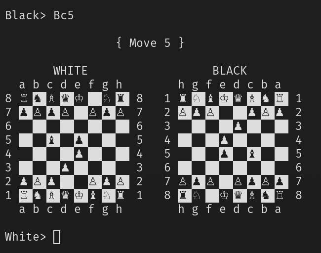

Chess CLI
=========

This is a simple, interactive command line app that lets you play chess.
Moves are input in algebraic notation. There is no chess engine / AI.

I've created this project in order to learn C++, so don't expect too much. ;D





How to Build
============

You need `cmake` and some compiler installed. Clone the repo and `cd` into it.

Compile via:
```
mkdir build
cd build
cmake ..
make
```

The resulting binary is at `build/bin/chess`.


TODO / Ideas
============

* [x] basic rendering & game loop
* [x] basic moves
* [x] legal castling
* [x] legal en passant
* [ ] detect check mate
* [ ] highlight previous move
* [ ] highlight check
* [ ] parse Portable Game Notation (PGN)
